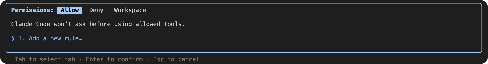
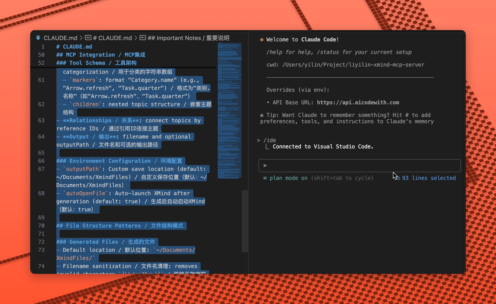

> 官方文档：[https://docs.anthropic.com/en/docs/claude-code/overview](https://docs.anthropic.com/en/docs/claude-code/overview)

---

## 快速启动

```bash
claude                        # 启动交互式对话
claude "解释项目架构"         # 带提示词启动
claude -p "优化代码"          # 一次性查询（非交互）
claude -c                     # 继续上次会话
claude update                 # 更新到最新版本
```

---

## 会话管理

```bash
/clear                        # 清除对话，开始新任务
/resume                       # 恢复历史对话
/compact                      # 压缩上下文，减少 token
/export clipboard             # 导出对话到剪贴板
/export file                  # 导出对话到文件

claude -r "abc123" "继续任务" # 恢复指定会话 ID
```

---

## 文件与上下文

```bash
@src/utils/helper.ts 优化函数  # 引用文件到上下文
@package.json 分析依赖         # 引用任意文件

/init                          # 初始化项目，生成 CLAUDE.md

# 添加额外工作目录
claude --add-dir ../apps ../lib
```

---

## 思考模式

```bash
think                         # 基础思考
think hard                    # 深度分析
think harder                  # 复杂问题
ultrathink                    # 超深度推理
```

**使用场景**：
- 简单任务 → 不加思考指令
- 需要分析 → `think`
- 算法优化 → `think harder`
- 架构设计 → `ultrathink`

---

## 权限与安全

```bash
/permissions                  # 设置文件/命令权限规则
/permissions deny delete src/ # 禁止删除 src 目录

# 预设允许的工具
claude --allowedTools "Bash(git log:*)" "Read"

# 预设禁止的工具
claude --disallowedTools "Edit" "Write"

# 跳过权限提示（⚠️ 谨慎使用）
claude --dangerously-skip-permissions
```



---

## 多任务与代理

```bash
/agent                        # 创建子代理处理多任务

# 动态定义自定义子代理
claude --agents '{
  "reviewer": {
    "description": "代码审查专家，主动审查代码变更",
    "prompt": "你是高级代码审查员，关注质量和安全",
    "tools": ["Read", "Grep", "Glob"],
    "model": "sonnet"
  },
  "debugger": {
    "description": "调试专家，处理错误和测试失败",
    "prompt": "你是调试专家，分析错误并提供修复方案"
  }
}'
```

**子代理配置字段**：
- `description`（必填）：何时调用该子代理
- `prompt`（必填）：子代理的行为指导
- `tools`（可选）：可使用的工具列表
- `model`（可选）：`sonnet` | `opus` | `haiku`

---

## IDE 集成

```bash
/ide                          # 开启 VSCode 联动（需插件）
```



**功能**：
- 实时代码同步
- 跳转到文件位置
- 查看诊断信息

---

## 模型选择

```bash
claude --model sonnet         # Claude Sonnet 4.5（推荐）
claude --model opus           # Claude Opus（最强推理）
claude --model haiku          # Claude Haiku（快速任务）

# 使用完整模型名称
claude --model claude-sonnet-4-5-20250929
```

**选型建议**：
- 日常开发 → `sonnet`（平衡性能和成本）
- 复杂架构 → `opus`（最强推理能力）
- 简单查询 → `haiku`（速度快，成本低）

---

## 系统提示词定制

```bash
# 完全替换默认提示词（完全控制）
claude --system-prompt "你是 Python 专家，只写类型注解代码"

# 从文件加载提示词（便于版本控制）
claude -p --system-prompt-file ./prompts/code-review.txt "审查 PR"

# 追加到默认提示词（推荐，保留默认功能）
claude --append-system-prompt "始终使用 TypeScript 和 JSDoc"
```

**对比**：
- `--system-prompt`：完全控制，失去默认功能
- `--system-prompt-file`：从文件加载，团队共享
- `--append-system-prompt`：最安全，保留默认能力

---

## 脚本与自动化

```bash
# 非交互模式（执行后退出）
claude -p "分析这段代码"

# 管道输入
cat logs.txt | claude -p "分析错误日志"
git diff | claude -p "生成提交信息"

# JSON 格式输出（便于脚本解析）
claude -p "query" --output-format json

# 流式 JSON 输出
claude -p --output-format stream-json --include-partial-messages "query"

# 限制代理回合数
claude -p --max-turns 3 "优化代码"

# 继续上次会话并执行命令
claude -c -p "检查类型错误"
```

---

## 输入输出格式

```bash
# 输出格式选项
--output-format text          # 纯文本（默认）
--output-format json          # JSON 格式
--output-format stream-json   # 流式 JSON

# 输入格式选项
--input-format text           # 纯文本输入（默认）
--input-format stream-json    # 流式 JSON 输入

# 组合使用
claude -p --output-format json --input-format stream-json
```

---

## 调试与诊断

```bash
/status                       # 查看当前状态和配置
/help                         # 查看帮助文档

# 详细日志输出（显示完整回合）
claude --verbose

# 查看模型调用详情
claude --verbose -p "query"
```

---

## 快捷键与交互

```bash
Shift + Tab                   # 切换模式（默认/Todo/自动）
#                             # 记忆模式（写入项目记忆）
```

---

## 记忆系统

### 会话记忆
- **存储位置**：无（临时）
- **作用范围**：仅当前对话
- **特点**：对话结束即清除

### 项目记忆
- **存储位置**：`./CLAUDE.md`
- **作用范围**：整个项目
- **用途**：项目配置、代码规范、架构说明

**示例 CLAUDE.md**：
```markdown
# 项目配置

## 技术栈
- React 18 + TypeScript
- 使用 Vite 构建
- 严格模式，禁止 any

## 代码规范
- 优先使用函数式组件
- 使用 ESLint + Prettier
- 测试覆盖率 > 80%
```

### 全局记忆
- **存储位置**：`~/.claude/CLAUDE.md`
- **作用范围**：跨所有项目
- **用途**：个人偏好、常用工作流

**示例全局 CLAUDE.md**：
```markdown
# 个人偏好

- 优先使用 TypeScript
- 提交信息使用约定式提交格式
- 代码注释用中文
```

---

## MCP 服务器配置

```bash
claude mcp                    # 配置 Model Context Protocol
```

**用途**：
- 集成外部工具和服务
- 扩展 Claude Code 功能
- 连接数据库、API 等

---

## 权限模式

```bash
# 以指定权限模式启动
claude --permission-mode plan

# 指定 MCP 工具处理权限提示
claude -p --permission-prompt-tool mcp_auth_tool "query"
```

---

## 常用场景速查

### 项目初始化
```bash
claude
/init                         # 生成 CLAUDE.md
# 描述项目架构、规范
```

### 代码审查
```bash
git diff | claude -p "审查变更并提出建议"

# 或使用自定义审查代理
claude --agents '{"reviewer": {...}}' "审查代码"
```

### 调试错误
```bash
npm test 2>&1 | claude -p "分析测试失败原因"
cat error.log | claude -p "分析错误日志"
```

### 生成文档
```bash
claude -p "为 src/utils 目录生成 README"
@src/components/Button.tsx 生成组件文档
```

### 重构代码
```bash
@src/legacy 使用现代 TypeScript 重构这些文件
think harder 如何优化这个算法的时间复杂度
```

### 压缩长对话
```bash
/compact 保留技术细节和代码片段
```

### 多任务并行
```bash
/agent                        # 创建子代理
# 同时处理：代码审查、文档生成、测试编写
```

---

## 最佳实践

### 项目启动流程
1. `claude` 启动对话
2. `/init` 学习项目结构
3. 在 CLAUDE.md 中记录项目规范
4. 使用 `@文件` 引用而非复制粘贴

### 对话管理技巧
1. **对话过长** → `/compact` 压缩上下文
2. **切换任务** → `/clear` 开始新对话
3. **保存重要对话** → `/export file`

### 权限配置建议
1. 使用 `/permissions` 限制敏感操作
2. 在 settings.json 中配置持久化规则
3. 危险操作前使用 `--permission-mode plan`

### 效率提升技巧
1. **复杂任务** → 使用 `think harder` 或 `ultrathink`
2. **重复任务** → 编写自定义子代理（`--agents`）
3. **脚本集成** → 使用 `-p` 和 `--output-format json`
4. **团队协作** → 共享 `--system-prompt-file`

### 成本优化
1. 简单查询使用 `--model haiku`
2. 使用 `/compact` 减少 token 消耗
3. 非交互模式使用 `--max-turns` 限制回合

---

## 故障排查

### 对话无法继续
```bash
/clear                        # 清除上下文重新开始
claude -r                     # 选择历史会话恢复
```

### 权限被拒绝
```bash
/permissions                  # 检查权限设置
claude --permission-mode plan # 使用计划模式
```

### 输出格式异常
```bash
claude --verbose -p "query"   # 查看详细日志
claude --output-format json   # 切换输出格式
```

### 更新相关
```bash
claude update                 # 更新到最新版本
claude --help                 # 查看版本和帮助
```

---

## 相关资源

- [官方文档](https://docs.anthropic.com/en/docs/claude-code/overview)
- [交互模式文档](https://docs.anthropic.com/en/interactive-mode)
- [Slash 命令参考](https://docs.anthropic.com/en/slash-commands)
- [SDK 文档](https://docs.claude.com/en/docs/agent-sdk)
- [常用工作流](https://docs.anthropic.com/en/common-workflows)
- [配置指南](https://docs.anthropic.com/en/settings)
